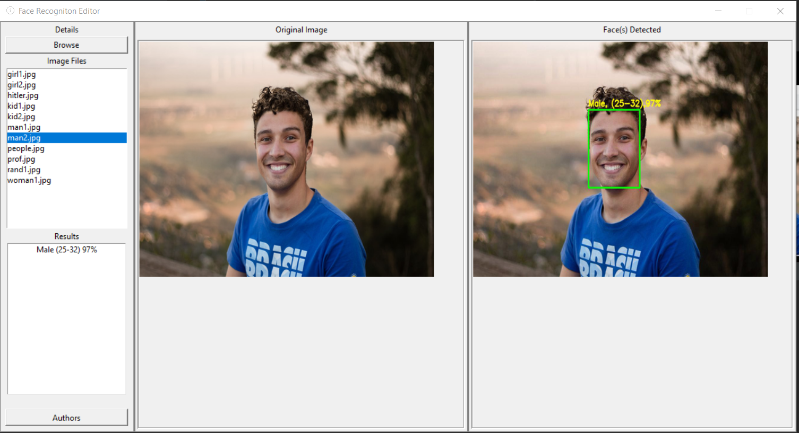
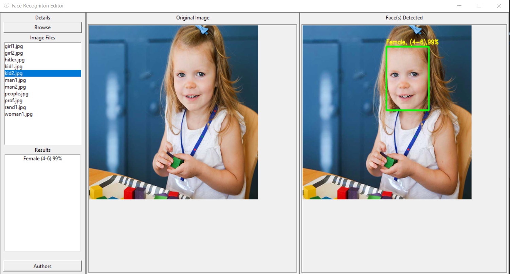
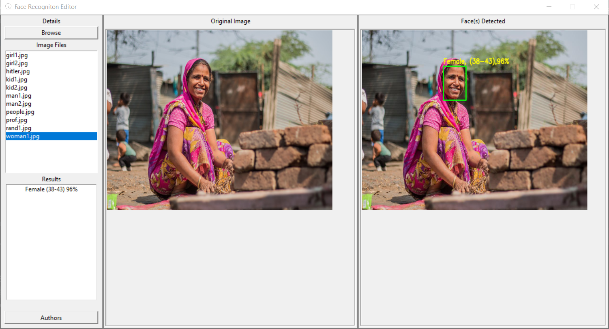

# Gender-and-Age-Detection   

<h2>Objective :</h2>

To  build a face recognition, gender and age detector that can approximately guess the gender and age of the person (face) in a picture .

<h2>About the Project :</h2>

In this Python Project,we have used Deep Learning to accurately identify the gender and age of a person from a single image of a face. We used the models trained by <a href="https://talhassner.github.io/home/projects/Adience/Adience-data.html">Tal Hassner and Gil Levi</a>. The predicted gender may be one of ‘Male’ and ‘Female’, and the predicted age may be one of the following ranges- (0 – 2), (4 – 6), (8 – 12), (15 – 20), (25 – 32), (38 – 43), (48 – 53), (60 – 100) (8 nodes in the final softmax layer). It is very difficult to accurately guess an exact age from a single image because of factors like makeup, lighting, obstructions, and facial expressions. And so, we made this a classification problem instead of making it one of regression.

<h2>Dataset :</h2>

For this python project, we have used the Adience and IMDB-wiki; the dataset is available in the public domain and you can find it <a href="https://www.kaggle.com/ttungl/adience-benchmark-gender-and-age-classification">here</a> and here . This dataset serves as a benchmark for face photos and is inclusive of various real-world imaging conditions like noise, lighting, pose, and appearance. The images have been collected from Flickr albums and distributed under the Creative Commons (CC) license. It has a total of 26,580 photos of 2,284 subjects in eight age ranges (as mentioned above) and is about 1GB in size. The models we  used had been trained on this dataset.

<h2>Additional Python Libraries Required :</h2>
<ul>
  <li>OpenCV</li>
  
       pip install opencv-python
</ul>

<h2>The contents of this Project :</h2>
<ul>
  <li>opencv_face_detector.pbtxt</li>
  <li>opencv_face_detector_uint8.pb</li>
  <li>age_deploy.prototxt</li>
  <li>age_net.caffemodel</li>
  <li>gender_deploy.prototxt</li>
  <li>gender_net.caffemodel</li>
  <li>a few pictures to try the project on</li>
  <li>detect.py</li>
  <li>main.py</li>
 </ul>
 
For face detection, we have a .pb file- this is a protobuf file (protocol buffer); it holds the graph definition and the trained weights of the model. We can use this to run the trained model. And while a .pb file holds the protobuf in binary format, one with the .pbtxt extension holds it in text format. These are TensorFlow files. For age and gender, the .prototxt files describe the network configuration and the .caffemodel file defines the internal states of the parameters of the layers.
The main.py file is the GUI integration of our detect.py script

 
 <h2>Usage :</h2>
 <ul>
  <li>Download my Repository</li>
  
  <li><b>Detecting Face, Gender and Age of face in Image</b> Use Command :</li>
  
      python main.py 
</ul>
  
<b>This will open up the GUI of the app</b>
 

# Working:

<h2>Examples :</h2>

<b>NOTE:- We downloaded the images from Google,if you have any query or problem we can remove them, we just used it for Educational purpose.</b>

    
 

 

    
    
